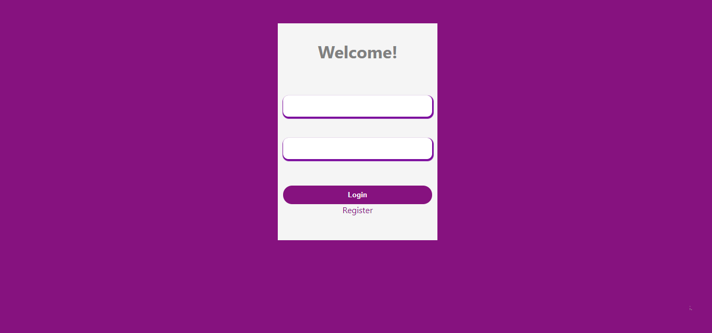
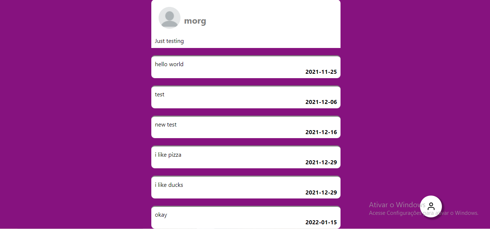
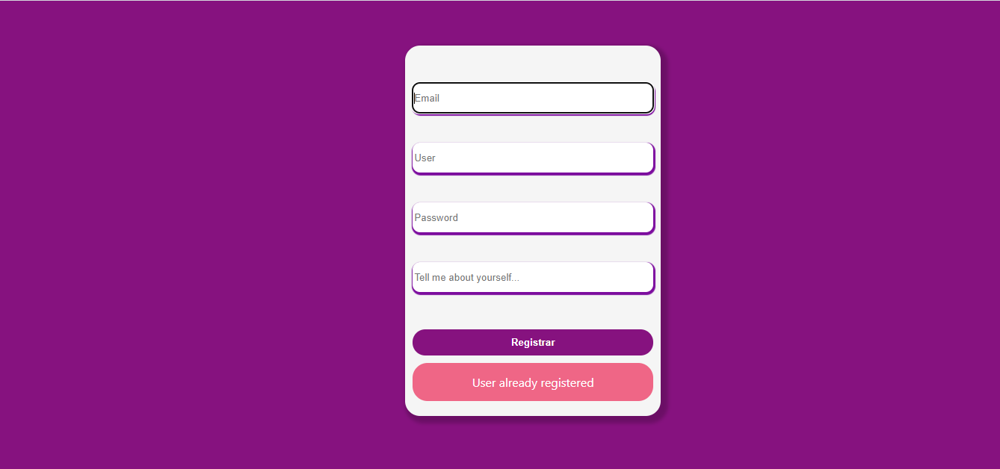
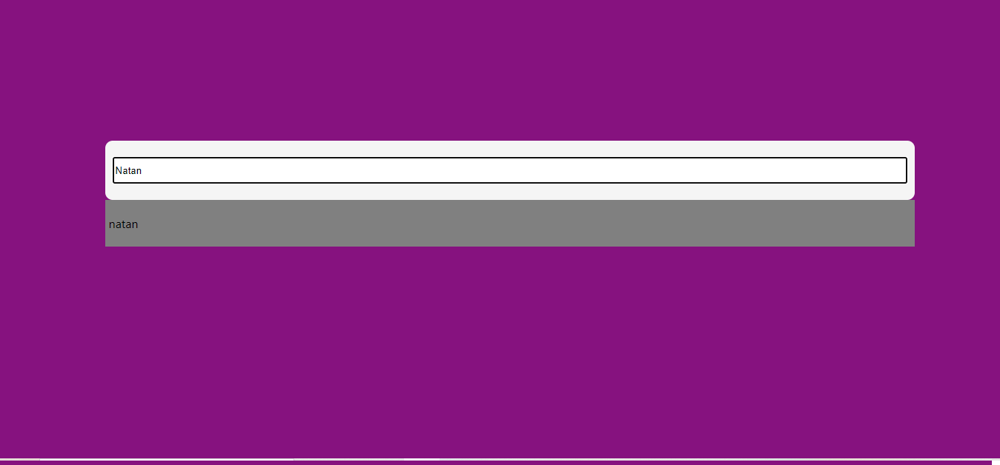
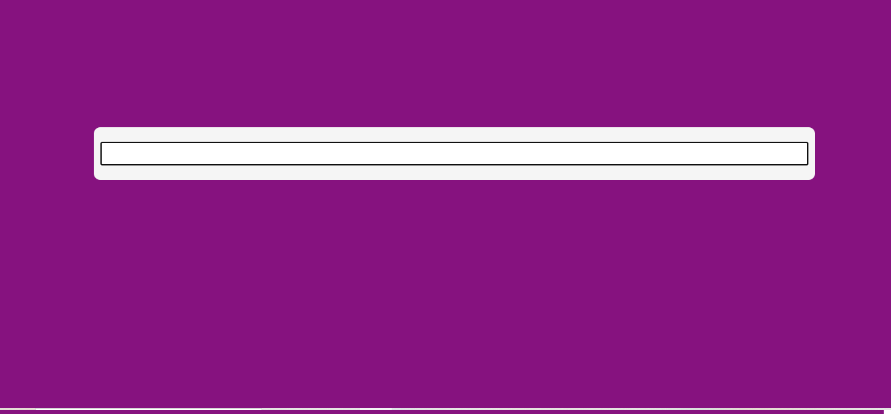

## Getting Started

First, run the development server:

```bash
npm run dev
# or
yarn dev
```

Open [http://localhost:3000](http://localhost:3000) with your browser to see the result.


# About it 
It's an exercise project to put in pratice what i've learned about React and study NextJs and its features.
It's functionality consist of making short posts and viewing the post of another user.

# Why 
I found the server side rendering interesting and since i wanted to start a new project using PHP on back-end 
putting it all togheter just fitted well.

# Sceens







By: [Erik](https://www.linkedin.com/in/erik-natan-moreira-santos-983865195/)